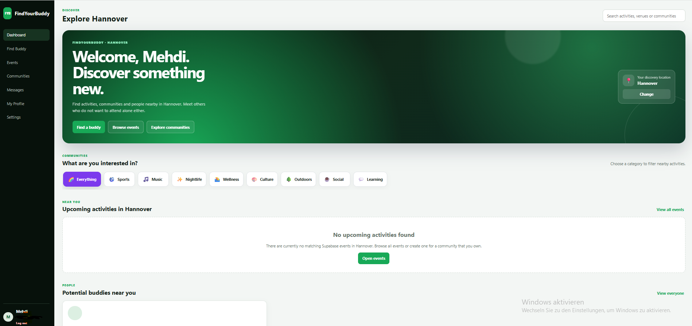
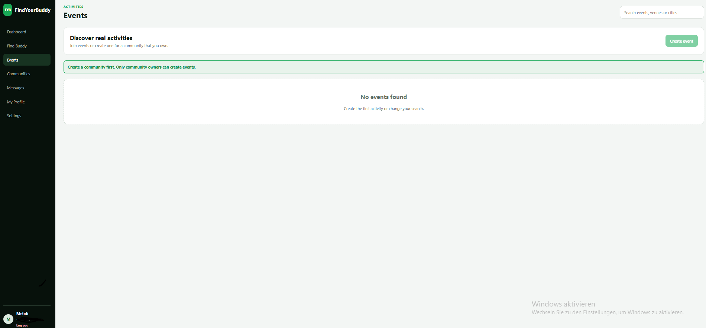
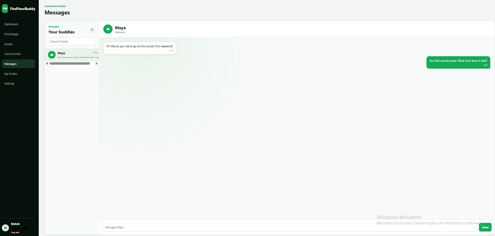

# FindYourBuddy

FindYourBuddy is an installable social discovery web application that helps people find buddies, communities, and local activities in their city.

Users can create profiles, discover people with similar interests, join communities, browse events, and send buddy requests.

## Live Demo

[Open the live FindYourBuddy application](YOUR_VERCEL_URL)

## Application Preview

### Dashboard

The dashboard displays nearby activities, community categories, and potential buddies based on the user's location.



### Event Discovery

Users can browse upcoming activities, view event details, and join events.



### Buddy Discovery

Users can discover other profiles, review interests and biographies, and send buddy requests.



## Main Features

* User registration and authentication
* Secure login and logout
* Editable user profiles
* City-based buddy discovery
* Interest and activity matching
* Buddy requests
* Accepting and declining buddy requests
* Accepted buddy relationships
* Community discovery
* Community memberships
* Event discovery
* Event attendance
* Responsive desktop interface
* Installable Progressive Web App
* Automatic PWA updates
* Supabase Row Level Security
* Vercel deployment

## How the Application Works

### Authentication

Users can create an account and sign in through Supabase Authentication. Sessions are restored when the application is reopened.

### Profiles

Each user can manage:

* Display name
* City
* Date of birth
* Occupation
* Favorite activities
* Biography
* Discovery visibility

### Buddy Discovery

Discoverable profiles appear in the Find Buddy area. Users can send requests, cancel pending requests, accept incoming requests, decline requests, and remove accepted buddy relationships.

### Communities

Users can browse local communities and join communities that match their interests.

### Events

Users can browse upcoming events, view event details, and join activities. Event information and attendance are stored in Supabase.

### Progressive Web App

FindYourBuddy can be installed through supported browsers and opened in a standalone application window.

## Technology Stack

### Frontend

* React
* JavaScript
* Vite
* CSS
* Progressive Web App
* Vite PWA Plugin

### Backend

* Supabase
* PostgreSQL
* Supabase Authentication
* Row Level Security
* PostgreSQL functions and triggers

### Deployment

* GitHub
* Vercel

## Security

The application uses Supabase Row Level Security policies to control access to database information.

Security measures include:

* Users can edit only their own profiles
* Private profile data is separated from public discovery data
* Buddy requests are restricted to the involved users
* Friendships are restricted to the involved users
* Community membership operations are validated
* Event attendance operations are validated
* Database operations use the Supabase publishable key
* Secret and service-role keys are not stored in the frontend

## Running the Project Locally

### Requirements

* Node.js
* npm
* A Supabase project

### Installation

Clone the repository:

```bash
git clone https://github.com/YOUR_GITHUB_USERNAME/findyourbuddy.git
```

Enter the project folder:

```bash
cd findyourbuddy
```

Install the dependencies:

```bash
npm install
```

Create a file named:

```text
.env.local
```

Add the following environment variables:

```env
VITE_SUPABASE_URL=YOUR_SUPABASE_PROJECT_URL
VITE_SUPABASE_PUBLISHABLE_KEY=YOUR_SUPABASE_PUBLISHABLE_KEY
```

Start the development server:

```bash
npm run dev
```

Create a production build:

```bash
npm run build
```

Preview the production build:

```bash
npm run preview
```

## PWA Installation

1. Open the live application in Chrome or Microsoft Edge.
2. Open the browser menu.
3. Select **Install page as app** or **Install FindYourBuddy**.
4. Confirm the installation.
5. Launch FindYourBuddy from the desktop, Start menu, or taskbar.

## Project Structure

```text
src/
├── components/
├── data/
├── lib/
├── pages/
├── utils/
├── App.css
├── App.jsx
├── index.css
└── main.jsx
```

## Current Project Status

Implemented:

* Authentication
* User profiles
* Buddy discovery
* Buddy requests
* Friendships
* Communities
* Community memberships
* Events
* Event attendance
* PWA installation
* Vercel deployment

Planned improvements:

* Real-time private messaging
* User blocking
* User reporting
* Profile image uploads
* Event image uploads
* Moderation tools
* Automated testing
* Accessibility improvements

## Project Purpose

FindYourBuddy was developed as a portfolio project to demonstrate frontend development, database integration, authentication, application security, responsive interface design, PWA configuration, and cloud deployment.

## Author

Developed by Mehdi Tounsi.
